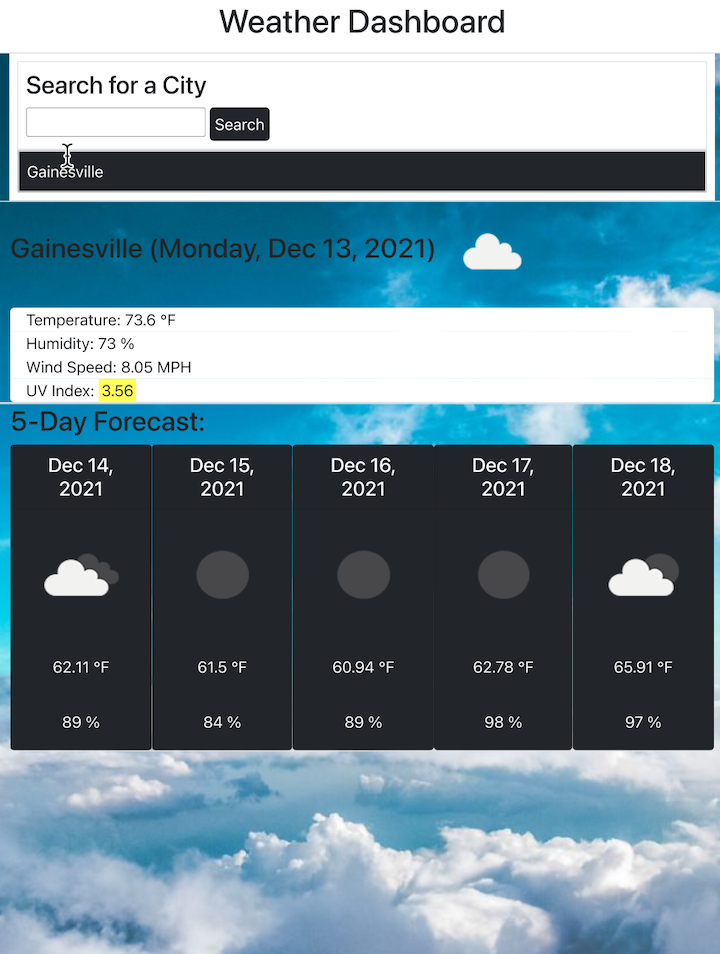

# server-side-APIs-weather-dashboard-6
## 06 Server Side API's: Weather Dashboard

### Description: 
#### This homework is a weather Dashboard that was completed by Jessica Haff. The purpose of this homework was to use server side API's to create a work day scheduler.
<br>
<br>

### Acceptance Criteria
```
GIVEN a weather dashboard with form inputs
WHEN I search for a city
THEN I am presented with current and future conditions for that city and that city is added to the search history
WHEN I view current weather conditions for that city
THEN I am presented with the city name, the date, an icon representation of weather conditions, the temperature, the humidity, the wind speed, and the UV index
WHEN I view the UV index
THEN I am presented with a color that indicates whether the conditions are favorable, moderate, or severe
WHEN I view future weather conditions for that city
THEN I am presented with a 5-day forecast that displays the date, an icon representation of weather conditions, the temperature, the wind speed, and the humidity
WHEN I click on a city in the search history
THEN I am again presented with current and future conditions for that city

```
<br>

### Links
[Link to Live Webpage](https://jesshaff.github.io/server-side-APIs-weather-dashboard-6/)

[Link to Github Repository](https://github.com/jesshaff/server-side-APIs-weather-dashboard-6)

<br>

### Screenshots
## -Working Code-
